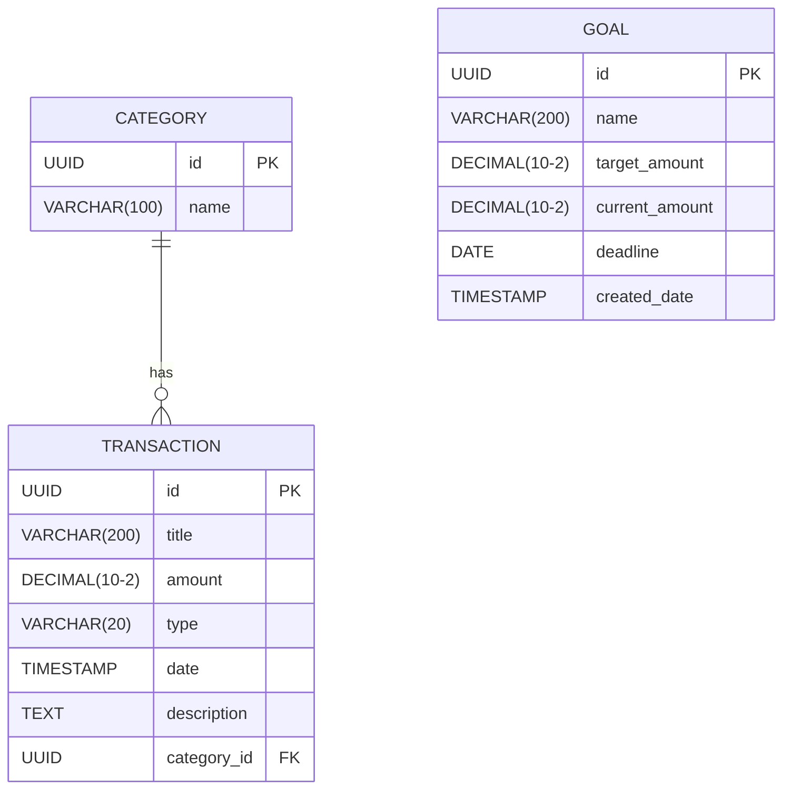
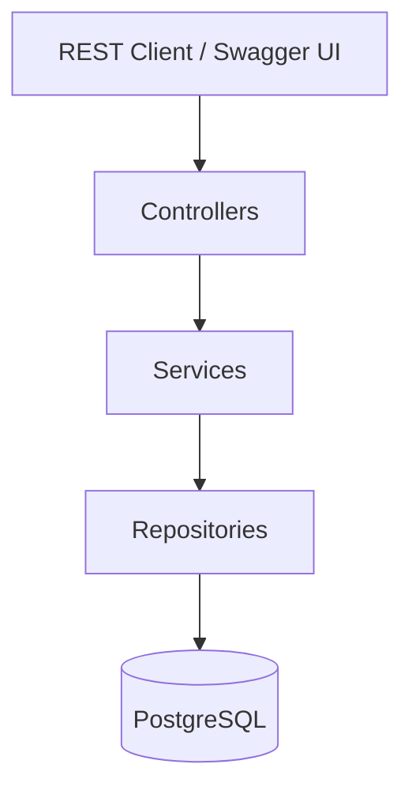
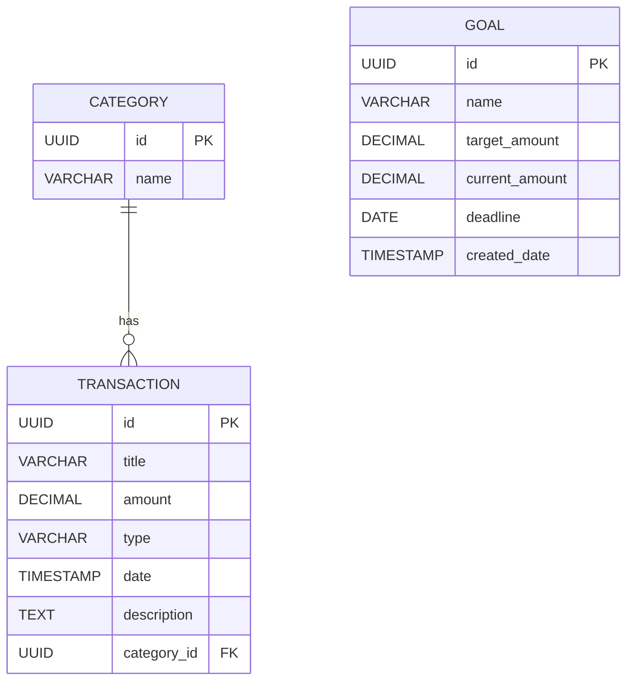

# Personal Finance Tracker — Backend Architecture

## Description

Spring Boot REST API to manage personal finance data (categories, transactions, goals) using a strict 3-layer architecture: Controller → Service → Repository.

## Tech Stack

| Tool                        | Role                     |
| --------------------------- | ------------------------ |
| Java 25                     | Language                 |
| Spring Boot 4.0.6 (WebMVC)  | Web framework            |
| Spring Data JPA + Hibernate | ORM                      |
| PostgreSQL                  | Database                 |
| springdoc-openapi 2.8.4     | Swagger UI documentation |
| Maven                       | Build tool               |

## Architecture Diagram

```mermaid
flowchart TD
    Client[Angular Frontend :4200] -->|HTTP REST JSON| CC[CategoryController]
    Client -->|HTTP REST JSON| TC[TransactionController]
    Client -->|HTTP REST JSON| GC[GoalController]

    CC --> CS[CategoryService]
    TC --> TS[TransactionService]
    GC --> GS[GoalService]

    CS --> CR[CategoryRepository]
    TS --> TR[TransactionRepository]
    TS --> CR
    GS --> GR[GoalRepository]

    CR -->|JPA| DB[(PostgreSQL)]
    TR -->|JPA| DB
    GR -->|JPA| DB

    GEH[GlobalExceptionHandler] -.->|@ControllerAdvice| CC
    GEH -.->|@ControllerAdvice| TC
    GEH -.->|@ControllerAdvice| GC

    CORS[WebConfig CORS] -.->|Allows :4200| CC
    CORS -.->|Allows :4200| TC
    CORS -.->|Allows :4200| GC
```

## Database Schema



## Package Structure

```
com.dauphine.finance/
├── FinanceTrackerBackendApplication.java   ← @SpringBootApplication + OpenAPI info
├── config/
│   └── WebConfig.java                     ← CORS (@Configuration + WebMvcConfigurer)
├── controllers/
│   ├── CategoryController.java            ← @RestController /v1/categories
│   ├── TransactionController.java         ← @RestController /v1/transactions
│   └── GoalController.java                ← @RestController /v1/goals
├── dto/
│   ├── CategoryCreateDTO.java
│   ├── TransactionCreateDTO.java
│   ├── TransactionUpdateDTO.java
│   ├── GoalCreateDTO.java
│   └── GoalUpdateDTO.java
├── models/
│   ├── Category.java                      ← @Entity
│   ├── Transaction.java                   ← @Entity + @ManyToOne Category
│   ├── Goal.java                          ← @Entity
│   └── TransactionType.java               ← enum INCOME / EXPENSE
├── repositories/
│   ├── CategoryRepository.java            ← JpaRepository + JPQL name search
│   ├── TransactionRepository.java         ← JpaRepository + JPQL multi-filter
│   └── GoalRepository.java                ← JpaRepository + JPQL order by date
├── services/
│   ├── CategoryService.java               ← @Service
│   ├── TransactionService.java            ← @Service (inner class TransactionSummary)
│   └── GoalService.java                   ← @Service
└── exceptions/
    ├── CategoryNotFoundException.java
    ├── TransactionNotFoundException.java
    ├── GoalNotFoundException.java
    └── GlobalExceptionHandler.java        ← @ControllerAdvice
```

## Endpoints

### Categories `/v1/categories`

| Method | Path                               | Description              | Status        |
| ------ | ---------------------------------- | ------------------------ | ------------- |
| GET    | `/v1/categories`                   | List all                 | 200           |
| GET    | `/v1/categories?name={name}`       | Filter by name           | 200           |
| GET    | `/v1/categories/{id}`              | Get by id                | 200, 404      |
| POST   | `/v1/categories`                   | Create                   | 201, 400      |
| PUT    | `/v1/categories/{id}`              | Update                   | 200, 400, 404 |
| DELETE | `/v1/categories/{id}`              | Delete                   | 204, 404      |
| GET    | `/v1/categories/{id}/transactions` | Transactions by category | 200, 404      |

### Transactions `/v1/transactions`

| Method | Path                                            | Description                       | Status        |
| ------ | ----------------------------------------------- | --------------------------------- | ------------- |
| GET    | `/v1/transactions`                              | List all (ordered by date desc)   | 200           |
| GET    | `/v1/transactions?q={text}`                     | Search title/description          | 200           |
| GET    | `/v1/transactions?type=`                        | Filter by INCOME/EXPENSE          | 200           |
| GET    | `/v1/transactions?categoryId=`                  | Filter by category                | 200           |
| GET    | `/v1/transactions?startDate=&endDate=`          | Filter by date range              | 200           |
| GET    | `/v1/transactions?minAmount=&maxAmount=`        | Filter by amount range            | 200           |
| GET    | `/v1/transactions/{id}`                         | Get by id                         | 200, 404      |
| POST   | `/v1/transactions`                              | Create                            | 201, 400      |
| PUT    | `/v1/transactions/{id}`                         | Update                            | 200, 400, 404 |
| DELETE | `/v1/transactions/{id}`                         | Delete                            | 204, 404      |
| GET    | `/v1/transactions/summary`                      | Income / expense / balance totals | 200           |
| GET    | `/v1/transactions/monthly-summary?year=&month=` | Monthly summary                   | 200, 400      |
| GET    | `/v1/transactions/expenses-by-category`         | Expense totals per category       | 200           |

### Goals `/v1/goals`

| Method | Path                    | Description                             | Status        |
| ------ | ----------------------- | --------------------------------------- | ------------- |
| GET    | `/v1/goals`             | List all (ordered by created date desc) | 200           |
| GET    | `/v1/goals/{id}`        | Get by id                               | 200, 404      |
| POST   | `/v1/goals`             | Create                                  | 201, 400      |
| PUT    | `/v1/goals/{id}`        | Replace                                 | 200, 400, 404 |
| PATCH  | `/v1/goals/{id}/amount` | Add amount to current                   | 200, 400, 404 |
| DELETE | `/v1/goals/{id}`        | Delete                                  | 204, 404      |

## Configuration

```properties
# DB (env vars)
spring.datasource.url=jdbc:postgresql://${DB_HOST}:${DB_PORT}/${DB_NAME}
spring.datasource.username=${DB_USERNAME}
spring.datasource.password=${DB_PASSWORD}

# JPA — schema managed via schema.sql, not auto-generated
spring.jpa.hibernate.ddl-auto=validate
spring.sql.init.mode=always

# Date format
spring.jackson.date-format=yyyy-MM-dd'T'HH:mm:ss.SSS'Z'
```

## Run

```bash
# Set env vars first (DB_HOST, DB_PORT, DB_NAME, DB_USERNAME, DB_PASSWORD)
./mvnw spring-boot:run
```

Swagger UI: `http://localhost:8080/swagger-ui/index.html`

## Tech Stack

- Java 25
- Spring Boot 4.0.6 (Web MVC, Data JPA)
- PostgreSQL
- springdoc-openapi (Swagger UI)

## Architecture Diagram



## Database Schema



## Endpoints

### Categories

- GET `/v1/categories` -> List all categories (200)
- GET `/v1/categories?name={name}` -> Filter by name (200)
- GET `/v1/categories/{id}` -> Get by id (200, 404)
- POST `/v1/categories` -> Create category (201, 400)
- PUT `/v1/categories/{id}` -> Update category (200, 400, 404)
- DELETE `/v1/categories/{id}` -> Delete category (204, 404)
- GET `/v1/categories/{categoryId}/transactions` -> Transactions by category (200, 404)

### Transactions

- GET `/v1/transactions` -> List all ordered by date desc (200)
- GET `/v1/transactions/{id}` -> Get by id (200, 404)
- GET `/v1/transactions?q={text}` -> Search in title/description (200)
- GET `/v1/transactions?type={INCOME|EXPENSE}` -> Filter by type (200)
- GET `/v1/transactions?categoryId={categoryId}` -> Filter by category (200)
- GET `/v1/transactions?startDate={date}&endDate={date}` -> Filter by date range (200)
- GET `/v1/transactions?minAmount={min}&maxAmount={max}` -> Filter by amount range (200)
- POST `/v1/transactions` -> Create transaction (201, 400)
- PUT `/v1/transactions/{id}` -> Update transaction (200, 400, 404)
- DELETE `/v1/transactions/{id}` -> Delete transaction (204, 404)
- GET `/v1/transactions/summary` -> Totals summary (200)
- GET `/v1/transactions/monthly-summary?year={year}&month={month}` -> Monthly summary (200, 400)
- GET `/v1/transactions/expenses-by-category` -> Expense totals per category (200)

### Goals

- GET `/v1/goals` -> List all goals (200)
- GET `/v1/goals/{id}` -> Get by id (200, 404)
- POST `/v1/goals` -> Create goal (201, 400)
- PUT `/v1/goals/{id}` -> Update goal (200, 400, 404)
- PATCH `/v1/goals/{id}/amount` -> Add amount (200, 400, 404)
- DELETE `/v1/goals/{id}` -> Delete goal (204, 404)

## Database Connection Properties

```
spring.datasource.url=jdbc:postgresql://${DB_HOST}:${DB_PORT}/${DB_NAME}
spring.datasource.username=${DB_USERNAME}
spring.datasource.password=${DB_PASSWORD}
```

## Initialization and JPA

- Schema is defined in `src/main/resources/schema.sql`
- JPA schema generation is disabled (validate)
- SQL init runs on startup

## Run Instructions

1. Ensure PostgreSQL is running.
2. Define environment variables: `DB_HOST`, `DB_PORT`, `DB_NAME`, `DB_USERNAME`, `DB_PASSWORD`.
3. Run the app:

```bash
./mvnw spring-boot:run
```

Swagger UI: `http://localhost:8080/swagger-ui/index.html`
