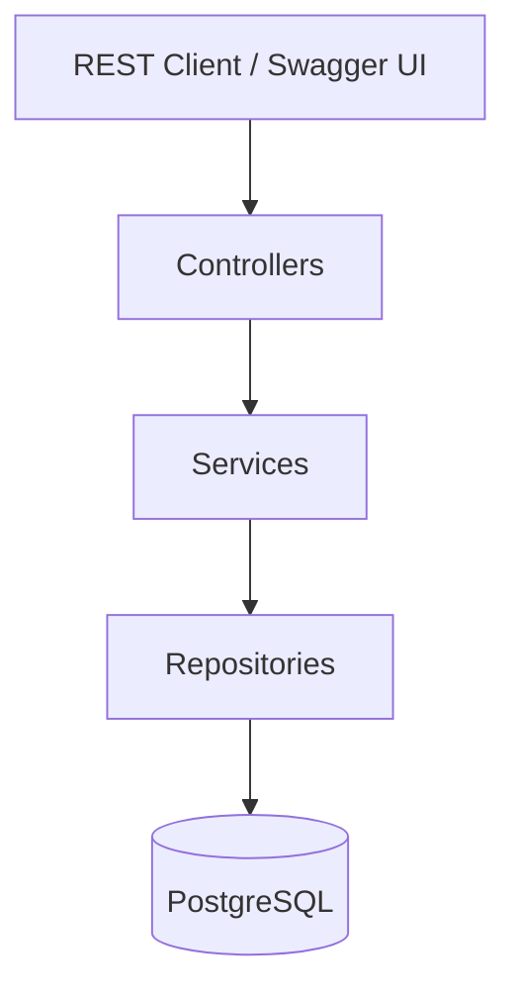
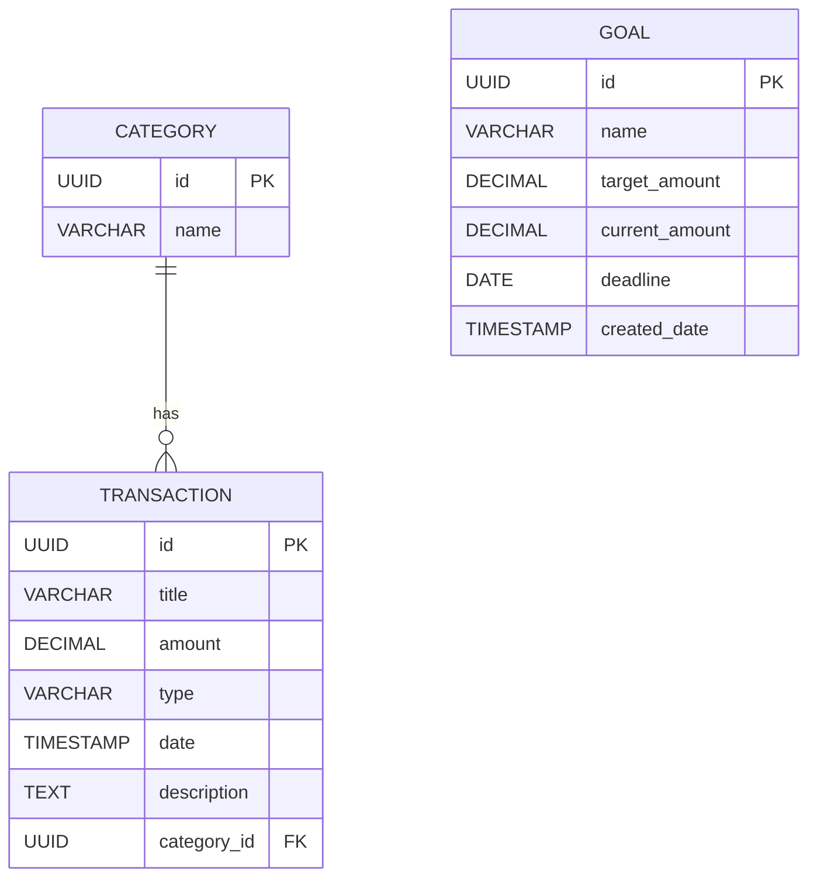

# Personal Finance Tracker Backend

## Description

Backend REST API to manage personal finance data (categories, transactions, goals) with a 3-layer architecture (Controller -> Service -> Repository).

## Tech Stack

- Java 25
- Spring Boot 4.0.6 (Web MVC, Data JPA)
- PostgreSQL
- springdoc-openapi (Swagger UI)

## Architecture Diagram



## Database Schema



## Endpoints

### Categories

- GET `/v1/categories` -> List all categories (200)
- GET `/v1/categories?name={name}` -> Filter by name (200)
- GET `/v1/categories/{id}` -> Get by id (200, 404)
- POST `/v1/categories` -> Create category (201, 400)
- PUT `/v1/categories/{id}` -> Update category (200, 400, 404)
- DELETE `/v1/categories/{id}` -> Delete category (204, 404)
- GET `/v1/categories/{categoryId}/transactions` -> Transactions by category (200, 404)

### Transactions

- GET `/v1/transactions` -> List all ordered by date desc (200)
- GET `/v1/transactions/{id}` -> Get by id (200, 404)
- GET `/v1/transactions?q={text}` -> Search in title/description (200)
- GET `/v1/transactions?type={INCOME|EXPENSE}` -> Filter by type (200)
- GET `/v1/transactions?categoryId={categoryId}` -> Filter by category (200)
- GET `/v1/transactions?startDate={date}&endDate={date}` -> Filter by date range (200)
- GET `/v1/transactions?minAmount={min}&maxAmount={max}` -> Filter by amount range (200)
- POST `/v1/transactions` -> Create transaction (201, 400)
- PUT `/v1/transactions/{id}` -> Update transaction (200, 400, 404)
- DELETE `/v1/transactions/{id}` -> Delete transaction (204, 404)
- GET `/v1/transactions/summary` -> Totals summary (200)
- GET `/v1/transactions/monthly-summary?year={year}&month={month}` -> Monthly summary (200, 400)
- GET `/v1/transactions/expenses-by-category` -> Expense totals per category (200)

### Goals

- GET `/v1/goals` -> List all goals (200)
- GET `/v1/goals/{id}` -> Get by id (200, 404)
- POST `/v1/goals` -> Create goal (201, 400)
- PUT `/v1/goals/{id}` -> Update goal (200, 400, 404)
- PATCH `/v1/goals/{id}/amount` -> Add amount (200, 400, 404)
- DELETE `/v1/goals/{id}` -> Delete goal (204, 404)

## Database Connection Properties

```
spring.datasource.url=jdbc:postgresql://${DB_HOST}:${DB_PORT}/${DB_NAME}
spring.datasource.username=${DB_USERNAME}
spring.datasource.password=${DB_PASSWORD}
```

## Initialization and JPA

- Schema is defined in `src/main/resources/schema.sql`
- JPA schema generation is disabled (validate)
- SQL init runs on startup

## Run Instructions

1. Ensure PostgreSQL is running.
2. Define environment variables: `DB_HOST`, `DB_PORT`, `DB_NAME`, `DB_USERNAME`, `DB_PASSWORD`.
3. Run the app:

```bash
./mvnw spring-boot:run
```

Swagger UI: `http://localhost:8080/swagger-ui/index.html`
